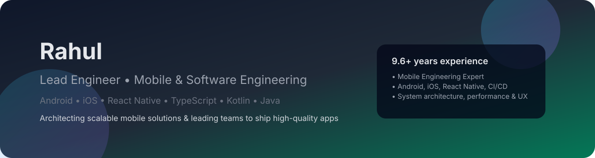

<!-- Banner -->

  

<h1 align="center">Hi, I'm Rahul 👋</h1>

  <strong>Lead Engineer | Mobile & Software Engineering</strong> 
  Android • iOS • React Native • TypeScript • Kotlin • Java

  
  
  

---

## 🧑‍💻 About Me

- 🏗️ Lead Engineer with **9.8 years** of experience in mobile & software engineering  
- 📱 Building scalable apps across **Android, iOS, React Native**  
- 🚀 Focused on **architecture, performance, CI/CD, and clean code**  
- 🤝 Enjoy mentoring teams and driving engineering best practices  
- 💡 Love working on user-centric products with solid UX and robust engineering

---

## 🛠 Tech Stack & Tools

### 📱 Mobile & Frontend

  
  
  
  
  

### 🔧 Languages & Architecture

  
  
  
  
  
  

### 🧰 Dev Practices & Infra

  
  
  
  

---

## 🧩 Featured Projects

### 🚗 Reemaq (05/2024 – Present)
**Tech:** React Native, TypeScript, Redux, Realm, REST APIs, CI/CD  
- End-to-end platform for **vehicle inspections**  
- Provides **fleet management** capabilities  
- Supports **online auctions** for vehicles  

---

### 👨‍👩‍👧 FROLO (11/2022 – 04/2024)
**Tech:** React Native, TypeScript, Redux, Realm, REST APIs, CI/CD  
- A **single-parent community** application  
- Connects local, like-minded single parents for **advice & support**  
- Helps users engage with the wider **Frolo community** for friendship and guidance  

---

### 💳 Payment Loyalty (10/2020 – 10/2022)
**Tech:** Kotlin, Android Native, Coroutines, REST APIs, CI/CD  
- Works with **Payment Service Providers (PSPs)** on payment terminals  
- Enables **customizable reward campaigns** at payment time  
- Improves customer engagement at the **point of sale**

---

### 🍽️ Order Pay (11/2019 – 09/2020)
**Tech:** Android Native (Java), Bluetooth  
- Mobile app for **restaurant food ordering**  
- Lets users **order directly from their table**  

---

## 📊 GitHub Stats

  <!-- Main stats -->
  
  <!-- Top languages -->
  

  <!-- Streak stats -->
  

